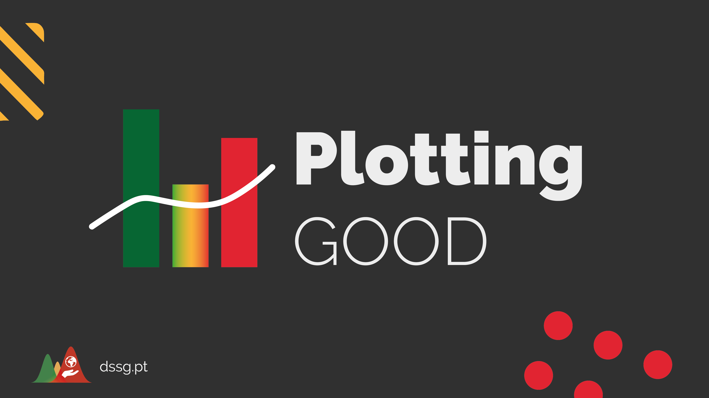

# 🤔 O que é?

A Plotting Good é uma iniciativa da [DSSG PT](www.dssg.pt) - inspirada no [TidyTuesday](https://github.com/rfordatascience/tidytuesday) - que tem como objectivo promover a criação de visualizações a partir de dados abertos sobre Portugal. Queremos chamar a atenção para temas da atualidade, com impacto social.

A cada semana publicamos um dataset sobre temas como economia, política, sociedade ou ambiente,  e incentivamos todos e todas a utilizar a sua tecnologia de eleição para produzir gráficos a partir desses dados. 

Depois, pedimos que partilhem o resultado final no Twitter, com a hashtag `#PlottingGoodDSSG` e o código ou outros ficheiros associados a esse trabalho.

# 💻 Como participar?

Periodicamente, vamos publicar na [conta de Twitter do DSSG PT](https://twitter.com/dssgpt) um dataset pré-processado por nós, em formato tabular (`.csv´), e um artigo/gráfico associado. Convidamos-vos a explorar os dados e a publicar no Twitter uma visualização que conte uma história associada a esse dataset.

Todos e todas as entusiastas de dados são convidados a participar, tendo em conta o seguinte:

- Incluam uma foto/vídeo da visualização no Twitter.
- Usem a hashtag `#PlottingGoodDSSG` no Twitter ao partilharem a vossa versão. Mesmo que o resultado final seja simples, partilhem - o foco é aprender!
- Incluam o código usado para criar a visualização, comentado sempre que possível. Caso seja usada uma ferramenta sem código (e.g. Flourish/DataWrapper), incluam o link. 
- Mencionem a fonte de dados original.

Recomendamos ainda, associado às publicações:

- Foquem em formas alternativas de contar uma história e não em criticar o artigo/gráfico original apresentado.
- Apoiem, através de críticas construtivas, os restantes participantes.
- O uso de texto alternativo de forma a garantir que os gráficos partilhados são também acessíveis a utilizadores de tecnologias como screen readers. [Aqui estão](https://medium.com/nightingale/writing-alt-text-for-data-visualization-2a218ef43f81) algumas dicas sobre como fazê-lo.

# 🔨 Ferramentas aceites

Podem usar qualquer ferramenta para a criação da visualização - algumas das mais comuns, onde a comunidade poderá dar apoio, são:
- Python (Altair, Seaborn, Matplotlib, ...)
- D3.JS (por exemplo, através do Observable)
- R (ggplot)
- Datawrapper
- Flourish
- Excel

# 📊 Submissões da comunidade

## Submissão de datasets
Esta iniciativa é construída em volta de datasets abertos portugueses, que podem ser submetidos sob a forma de Issues para o repositório.

Conheces um dataset que a comunidade poderia ter interesse em explorar? Submete o pedido através de um [novo issue](https://github.com/dssgPT/Plotting-Good-DSSG/issues/new/choose), através do template "Novo dataset", ou enviar a mesma informação por e-mail para hello@dssg.pt. 

## Submissão de código
Se quiseres submeter o teu exemplo, cria um novo Pull Request para este dataset, colocando os teus ficheiros de código na seguinte estrutura:

``` desafios / nome_do_desafio / exemplos / USERNAME DE GITHUB DO CRIADOR / ... ```

O Pull Request será revisto por um membro da DSSG PT e, caso cumpra a estrutura, aceite. 

# 🌍 Sobre a Data Science for Social Good Portugal

A [Data Science for Social Good Portugal](https://www.dssg.pt) é uma comunidade aberta de cientistas de dados, amantes de dados e entusiastas de dados que querem atacar problemas que importam verdadeiramente. Acreditamos no poder dos dados para transformar a nossa sociedade para o melhor e para todos.

[@dssgPT](https://twitter.com/dssgpt) | [fb.com/DSSGPortugal](https://facebook.com/DSSGPortugal/) | [Instagram @dssg_pt](https://instagram.com/dssg_pt/) | [LinkedIn](https://linkedin.com/company/dssg-portugal)
